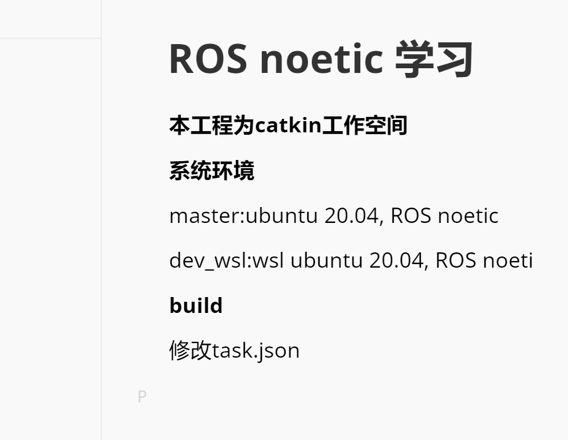

# ROS noetic 学习

**本工程为catkin工作空间**

**系统环境**

master:ubuntu 20.04, ROS noetic

dev_wsl:wsl ubuntu 20.04, ROS noeti

**build**

修改task.json

## 编译环境
1. ubuntu 20.04 
2. ros noetic 

### 编译

1. $printenv | grep ROS 
2. $...src/wpr_simulation/scripts/install_for_noetic.sh
3. $...src/wpb_home/wpb_home_bringup/scripts/install_for_noetic.sh
4. fs@fsLaptop:~/<catkin工作目录>$ catkin_make

| Syntax      | Description |
| ----------- | ----------- |
| Header      | Title       |
| Paragraph   | Text        |